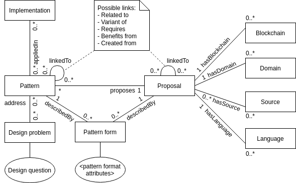

# Harmonica's blockchain-based software pattern ontology

<div align="center">
    <br/>
    <p>
        This GitHub is the repository of a blockchain-based software pattern ontology, and a tool to navigate in it and get recommendations. This tool will be merged later with <a href="https://github.com/harmonica-project/BLADE">BLADE</a> later to create a tool for decision-making of blockchain technologies and patterns, stay tuned!
    </p>
    <p>
        Do you want to try it? <a href="http://onto-tool.blade-blockchain.eu/">Click here to access the tool</a>.
    </p>
  <br/>
</div> 

## Introduction

In this repository, you will find a blockchain-based software pattern ontology, that contains 160 software patterns on blockchain found in the academic literature. You will also find a tool that enables the exploration of the ontology through a graphical interface with filters. The tool also proposes a recommender to generate a set of adequate patterns to a user, as he answers a set of questions.
Finally, this repository contains a Python script capable of converting the Excel spreadsheet of collected software patterns to our ontology. 

To start, you can read our paper introducing in detail the ontology (coming soon), the method employed to create it, the tool, and a survey performed to validate the tool usability. You can also [check additional resources](#resources) below, that were not included in the paper. You will also found in [setup](#setup) some documentation to start the tool on your own machine and, if you want, regenerate the ontology using the Excel sheet.

## Ontology description and visualisation

This ontology is written in Turtle and uses the OWL concepts. You can open it in [Protégé](https://protege.stanford.edu/). If you want to learn about the ontology in depth, feel free to explore it or read the paper. Nevertheless, this section will give you some indications on its construction. The following image will give you a glance of the ontology conceptual model:



The central element of this model is the Proposal. 
A Proposal is a Pattern proposed by multiple Sources (for this first iteration, a Source = an academic paper). Each Proposal proposes a Pattern, represented by the Pattern class. Thus, a Pattern is the combination of one or multiple Proposals.

In general, a pattern is described by a pattern form (eg. [GoF format](https://hillside.net/index.php/gang-of-four-template)). In this model, a Pattern as well as Proposals are described by a Pattern form, that have the attributes of its respective chosen pattern form.

Each pattern address one or more Design problems, presented as a taxonomy of problems (see below for more information). Also, each Proposal is linked to a specific Blockchain, Domain, and Language. This is the context of the Proposal.

## Resources

This repository hosts documents that were not included in our paper due to inherent size limit of the publication. Those documents have been placed in the [documents](https://github.com/harmonica-project/blockchain-patterns-ontology/tree/main/documents) directory. The list of documents is the following:

- [Pattern taxonomy](https://github.com/harmonica-project/blockchain-patterns-ontology/blob/main/documents/Pattern%20taxonomy.pdf): this document describes the pattern taxonomy, created during the completion of a previous systematic literature review (link below).
- [Problem ontology and questions](https://github.com/harmonica-project/blockchain-patterns-ontology/blob/main/documents/Problem%20ontology.pdf): for recommendation purposes, we created a problem ontology that is similar in its structure to the pattern taxonomy, and we designed some questions associated to those problems to enable recommendation making.
- [Ontology Requirements Specification Document (ORSD)](https://github.com/harmonica-project/blockchain-patterns-ontology/blob/main/documents/ORSD.pdf): contains the context, requirements, and competency questions of the ontology.
- [Experimental protocol](https://github.com/harmonica-project/blockchain-patterns-ontology/blob/main/documents/Experimental%20protocol.pdf): describes the experimental protocol employed to survey participants to evaluate the tool ontology produced in this work.

Another resource can be mentioned, that is the blockchain pattern collection. A systematic literature review were performed before creating the ontology to collect many blockchain-based software from the academic literature. Full results are available following [this link](https://github.com/harmonica-project/blockchain-patterns-collection).

## Setup

### Tool setup

To setup the tool on your own machine, make sure you have the following package installed:

- Node.js (current version: v10.19)
- npm (current version: v6.14.4)
- [Apache Jena Fuseki](https://jena.apache.org/documentation/fuseki2/) (current version: v4.2, please follow the documentation on the website to install the tool AND enable Fuseki to be launched as a command by moving it to your $PATH!)

To start, you'll have to setup your Apache Jena Fuseki to serve the ontology as a database. Go into the [ontologies](https://github.com/harmonica-project/blockchain-patterns-ontology/tree/main/ontologies) folder, and execute the following command:

```
fuseki-server --file ./result.ttl /result
```

Your server will probably serve at this address: http://localhost:3030/result/query. Make sure this is the case by following the link, then go into the tool source code in [fuseki.js](https://github.com/harmonica-project/blockchain-patterns-ontology/blob/main/tool/src/libs/fuseki.js), and change the FUSEKI_URL variable content by the Fuseki server URL.

Finally inside the [tool](https://github.com/harmonica-project/blockchain-patterns-ontology/tree/main/tool) repository, and execute the following commands:

```
npm install
npm start
```

If everything went fine, you should be able to open the tool on [localhost:3000](localhost:3000) and start using it. You can make sure that you are connected to Fuseki by checking the server status on home page: it should display connected. If you have an issue, please let us know by opening an issue on GitHub.

### Ontology generation

If you want, you can also regenerate the ontology by yourself. As this is an ad-hoc tool, the process is not that simple; the following section will try to give some information to do that. 

A Python script is used in this process: [gen_ontology.py](https://github.com/harmonica-project/blockchain-patterns-ontology/blob/main/automation/gen_ontology.py). You can execute the script by running the following command (no package is required):

```
python3 gen_ontology.py
```

It will convert the patterns_data.json file into the ontology in the ontology folder. The problem is the generation of that file, which is not that easy. 

To do that, follows this ad-hoc process:

1. Download the Excel spreadsheet in [this repository](https://github.com/harmonica-project/blockchain-patterns-collection). Modify it as you want by making sure to respect the file organization (patterns from papers and patterns created from the fusion of all of them, papers, pattern links ...).
2. Rename the "Raw pattern collection" sheet in "Paper patterns", and the "RQ2" sheet in "Canonical patterns". Delete the "Summary", "RQ3", and "RQ4" sheets.
3. Use a XLSX to JSON parser, such as [this website](https://beautifytools.com/excel-to-json-converter.php). 

The resulting file can be used by the Python script to generate the ontology.

